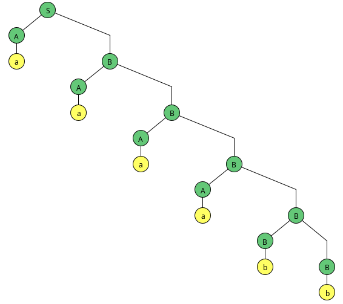
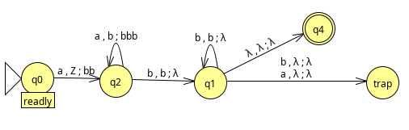
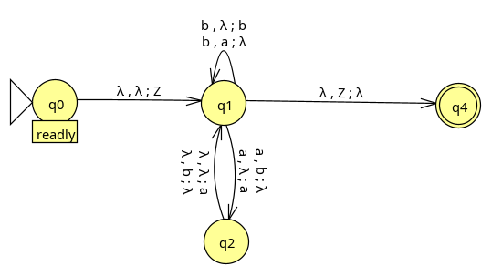
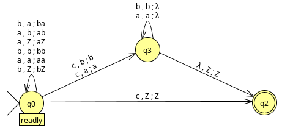

---
header-includes:
  - \usepackage{listings}
---

# CS 321H Homework 4

## Lyell Read

---

### 1. (5 pts) Convert the grammar below to CNF.

  $G = (V,T,S,P)$ where

  $V = \{ S, A, B, C, D \}$

  $T = \{ 0, 1, 2 \}$

  $P =$

\lstset{
  xleftmargin=4em,
  literate={->}{$\rightarrow$}{2}
           {lambda}{$\lambda$}{1}
}

\begin{lstlisting}
S -> A | ABD | 0BB
A -> 0 | BAA
B -> BB | 1 | 2 | lambda
C -> CD | 0
D -> D1 | DD
\end{lstlisting}

Answer: 

- Eliminate start symbols from RHS (none)
- Remove lambda symbols

\begin{lstlisting}
S -> A
S -> ABD
S -> aBB
A -> b
A -> BAA
B -> BB
B -> b
B -> c
D -> Db
D -> DD
S -> AD
S -> a
S -> aB
A -> AA
B -> B
\end{lstlisting}

- Eliminate unit productions

\begin{lstlisting}
S -> ABD
S -> aBB
A -> b
A -> BAA
B -> BB
B -> b
B -> c
D -> Db
D -> DD
S -> AD
S -> a
S -> aB
A -> AA
S -> b
S -> BAA
S -> AA
\end{lstlisting}

- Eliminate useless productions

\begin{lstlisting}
S -> aBB
S -> a
S -> aB
S -> b
S -> BAA
S -> AA
A -> AA
B -> c
B -> b
B -> BB
A -> BAA
A -> b
\end{lstlisting}

Convert to Chomsky

\begin{lstlisting}
S -> Ba | D2
D2 -> BB
S -> a
S -> Ba | B
Ba -> a
S -> b
S -> BD1
S -> AA
A -> b
A -> BD1
D1 -> AA
A -> AA
B -> BB
B -> b
B -> c
\end{lstlisting}

### 2. (10 pts) Consider the CNF grammar 
  $G = (V,T,S,P)$ where

  $V = \{ S, A, B, C, D \}$ 

  $T = \{ a, b, c \},$

  $S = S$

  $P =$

\begin{lstlisting}
S -> AB | AD | AC
A -> AA | a
B -> BB | AB | b
C -> AC | DC | c
D -> DD | b | c
\end{lstlisting}

**Use the CYK algorithm to determine if the strings $w_{1} = \text { babbc }$ and $w_{2} = \text { aaaabb }$ are in the language $L(G)$. Show the DP table. If the string is in $L(G)$ construct the parse tree.**

Response:

- $w_{1} = babbc$

| i/j |  1  |  2  |  3  |  4  |  5  |
|-----|-----|-----|-----|-----|-----|
| 1   | B,D |     |     |     |     |
| 2   |     |   A |     |     |     |
| 3   |     |     | B,D |     |     |
| 4   |     |     |     | B,D |     |
| 5   |     |     |     |     | C,D |

| i/j |  1  |  2  |  3  |  4  |  5  |
|-----|-----|-----|-----|-----|-----|
| 1   | B,D |  $\emptyset$  |     |     |     |
| 2   |     |  A  | B,S |     |     |
| 3   |     |     | B,D | B,D |     |
| 4   |     |     |     | B,D | C,D |
| 5   |     |     |     |     | C,D |

| i/j |  1  |  2  |  3  |  4  |  5  |
|-----|-----|-----|-----|-----|-----|
| 1   | B,D |  $\emptyset$  |  B  |     |     |
| 2   |     |  A  | B,S | S,B |     |
| 3   |     |     | B,D | B,D | C,D |
| 4   |     |     |     | B,D | C,D |
| 5   |     |     |     |     | C,D |

| i/j |  1  |  2  |  3  |  4  |  5  |
|-----|-----|-----|-----|-----|-----|
| 1   | B,D |  $\emptyset$  |  B  |  B  |     |
| 2   |     |  A  | B,S | S,B |  S  |
| 3   |     |     | B,D | B,D | C,D |
| 4   |     |     |     | B,D | C,D |
| 5   |     |     |     |     | C,D |

| i/j |  1  |  2  |  3  |  4  |  5  |
|-----|-----|-----|-----|-----|-----|
| 1   | B,D |  $\emptyset$  |  B  |  B  |  $\emptyset$  |
| 2   |     |  A  | B,S | S,B |  S  |
| 3   |     |     | B,D | B,D | C,D |
| 4   |     |     |     | B,D | C,D |
| 5   |     |     |     |     | C,D |

String not accepted, as there is no S in top right corner. 

$\pagebreak$

- $w_{2} = aaaabb$

| i/j |  1  |  2  |  3  |  4  |  5  |  6  |
|-----|-----|-----|-----|-----|-----|-----|
| 1   |  A  |     |     |     |     |     |
| 2   |     |  A  |     |     |     |     |
| 3   |     |     |  A  |     |     |     |
| 4   |     |     |     |  A  |     |     |
| 5   |     |     |     |     | B,D |     |
| 6   |     |     |     |     |     | B,D |

| i/j |  1  |  2  |  3  |  4  |  5  |  6  |
|-----|-----|-----|-----|-----|-----|-----|
| 1   |  A  |  A  |     |     |     |     |
| 2   |     |  A  |  A  |     |     |     |
| 3   |     |     |  A  |  A  |     |     |
| 4   |     |     |     |  A  |  S  |     |
| 5   |     |     |     |     | B,D | B,D |
| 6   |     |     |     |     |     | B,D |

| i/j |  1  |  2  |  3  |  4  |  5  |  6  |
|-----|-----|-----|-----|-----|-----|-----|
| 1   |  A  |  A  |  A  |     |     |     |
| 2   |     |  A  |  A  |  A  |     |     |
| 3   |     |     |  A  |  A  |  S  |     |
| 4   |     |     |     |  A  |  S  |  S  |
| 5   |     |     |     |     | B,D | B,D |
| 6   |     |     |     |     |     | B,D |

| i/j |  1  |  2  |  3  |  4  |  5  |  6  |
|-----|-----|-----|-----|-----|-----|-----|
| 1   |  A  |  A  |  A  |  A  |     |     |
| 2   |     |  A  |  A  |  A  |  S  |     |
| 3   |     |     |  A  |  A  |  S  |  S  |
| 4   |     |     |     |  A  |  S  |  S  |
| 5   |     |     |     |     | B,D | B,D |
| 6   |     |     |     |     |     | B,D |

| i/j |  1  |  2  |  3  |  4  |  5  |  6  |
|-----|-----|-----|-----|-----|-----|-----|
| 1   |  A  |  A  |  A  |  A  |  S  |     |
| 2   |     |  A  |  A  |  A  |  S  |  S  |
| 3   |     |     |  A  |  A  |  S  |  S  |
| 4   |     |     |     |  A  |  S  |  S  |
| 5   |     |     |     |     | B,D | B,D |
| 6   |     |     |     |     |     | B,D |

| i/j |  1  |  2  |  3  |  4  |  5  |  6  |
|-----|-----|-----|-----|-----|-----|-----|
| 1   |  A  |  A  |  A  |  A  |  S  |  S  |
| 2   |     |  A  |  A  |  A  |  S  |  S  |
| 3   |     |     |  A  |  A  |  S  |  S  |
| 4   |     |     |     |  A  |  S  |  S  |
| 5   |     |     |     |     | B,D | B,D |
| 6   |     |     |     |     |     | B,D |

String accepted, as S is in top right corner.

Parse Tree: 

{height=300px}

$\pagebreak$

### 3. (15 pts) Construct npda’s that accept the following languages on $\Sigma = \{ a, b \}$. Give both a verbal explanation on how your npda works and the formal definition including the transition function and/or transition graph. You must use JFLAP. Submit the transition graph in the HW pdf and the JFLAP code file for each problem.

- a. $L = \{ a^{n}b^{2n} : n \geq 0 \}$

NPDA:

{height=200px}

Explanation:

This NPDA works as a result of the stack being used as a tally of the required remaining `b` characters - that is, every time it reads an `a`, it adds two `b` characters to the stack, and when it reads the first `b`, it begins pulling from the stack.

- b. $L = \{ w : n_{a}(w) = 2n_{b}(w) \}$

NPDA:

{height=200px}

Credit: https://scholar.harvard.edu/files/harrylewis/files/ps4a_solutions.pdf

Explanation:

This NPDA operates very simply and beautifully to ensure that when the stack is empty, the number of `b` characters is double the number of `a` characters. It does this using the nondeterminism of an NDPA. After pushing an end of stack character, the program decides whether to push a `b` or pop an `a` when it locates a `b` at the start of the string. It also makes a choice between the following:

1. Push a `b` and push another `b`
2. Push a `b` and pop an `a`
3. Push an `a` and push a `b`
4. Push an `a` and pop an `a`

when it encounters an `a` character at the start of the string. Finally, when it encounters the end of stack character at the top of the stack, it will succeed.

- c. $L = \{ wcw^{R} : w \in \{ a,b \}* \}$

NPDA:

{height=200px}

Sources: 

https://www.geeksforgeeks.org/npda-for-accepting-the-language-l-wwr-w-ab/

http://www.cs.sjsu.edu/faculty/pollett/154.3.07s/Hw4.pdf

Explanation:

This NPDA is essentially a palindrome checker that specifies that there must be a `c` in the middle of the palindrome, and the word alphabet is $\Sigma = \{ a, b \}$. It does this by pushing a copy of the start of the palindrome, up to `c` on the stack, and verifying that the same string is read after `c`, before finishing. Even knowing that $R \geq 0$, we include a case to catch the string `c`, as this would be a string where $R = 1, w = \lambda$.