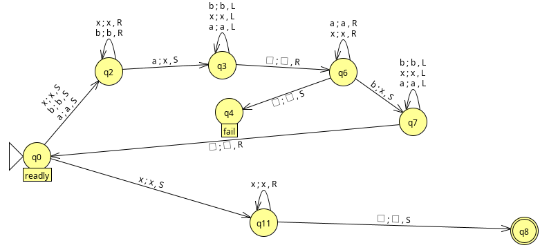
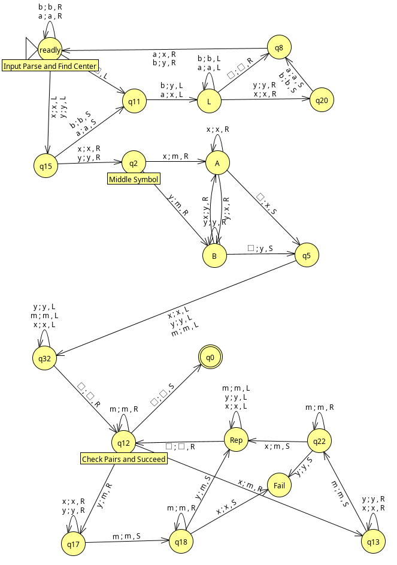
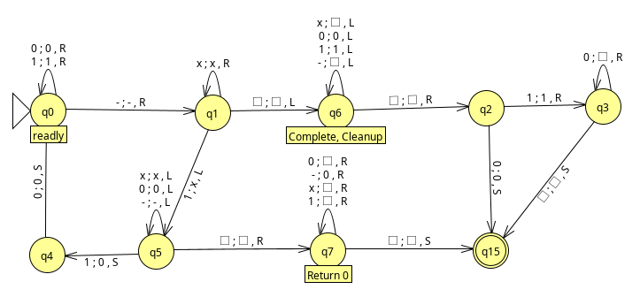
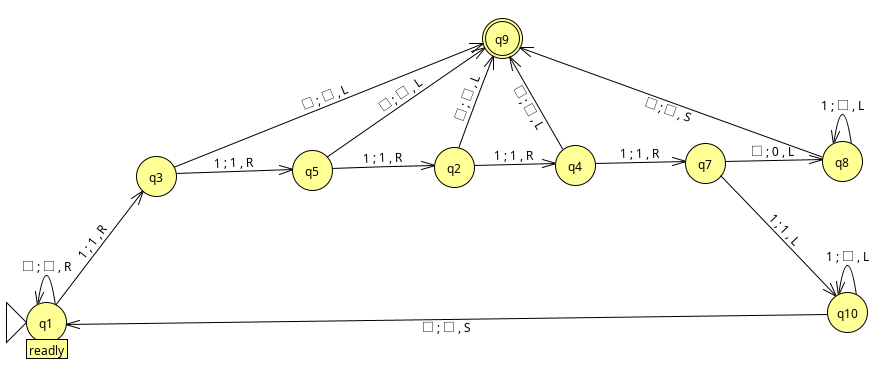

---
header-includes:
  - \usepackage{listings}
  - \usepackage{mathtools}
---

# CS 321H Homework 5

## Lyell Read

---

Submit to Canvas a pdf file containing verbal explanations and transition graphs for the Turing machines in problems 1 & 2 and the written answers to problems 3 & 4. Also submit JFLAP .jff files (named youronidnameP1a, youronidnameP1b, etc.) for problems 1 & 2.

### 1. (10 pts) Design single-tape Turing machines that accept the following languages using JFLAP

- a. $L_{2} = \{ w : n_{a}(w) = n_{b}(w) : w\in \{a, b\}^{+} \}$.

{height=300px}

$\pagebreak$

- b. $L_{3} = \{ww : w \in \{a, b\}^{+} \}$.

{height=600px}

$\pagebreak$

### 2. (10 pts) Design Turing Machines using JFLAP to compute the following functions for x and y positive integers represented in unary. The value f(x) represented in unary should be on the tape surrounded by blanks after the calculation.

- a.
$f(x) =
\begin{dcases}
  x-y & x > y\\
  0 & otherwise 
\end{dcases}$

{height=300px}

- b. $f(x) = x \mod 5$

{height=300px}

$\pagebreak$

### 3. (5 pts) The nor of two languages is defined below, prove that recursive languages are closed under the nor operation.:

$$nor(L_1, L_2) = \{ w: w  \notin L_1 \ and \ w \notin L_2\}.$$

### 4. (5 pts) Suppose we make the requirement that a Turing machine can only halt in a final state, that is, we require that (q,a) be defined for all pairs $(q,a)$ with $q \notin F \ and \ a \notin \Gamma$. Does this restrict the power of the Turing machine? Prove your answer.

