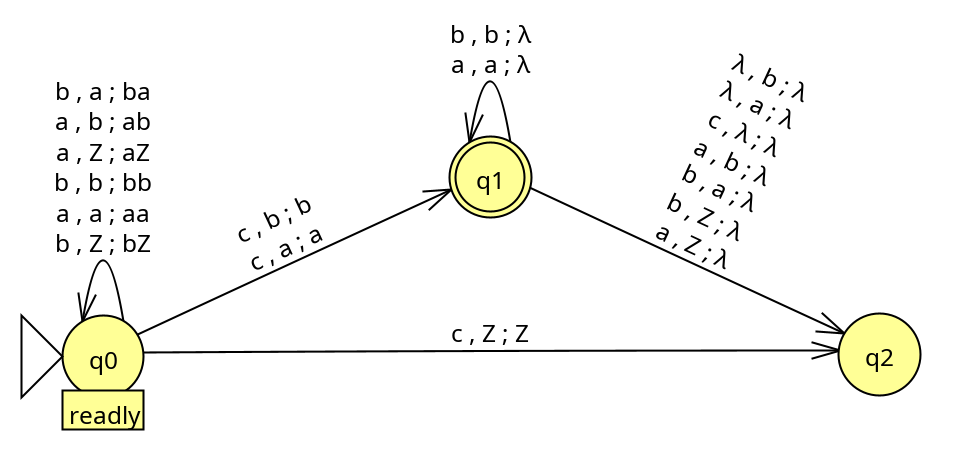

# Project 2

Lyell Read, CS321H, F2020

Prompt 1: Using any programming language write a program or app that takes as input the definition of an DPDA $M$ and then when given a string $w$ determines if $w \in L(M)$. The input can be either read from a file or entered in the command line. Modify the program to determine if $w \in L(M)^{C}$ (the complement of $L(M)$).

## Program Explanation

This program is a python program that uses built in data structures (`list`, `string`, `set`) to process a string through a DPDA provided as a JSON file. 

First, it parses the JSON, and makes simple checks that ensure that the DPDA is somewhat consistent with the formal specification. These checks ensure that the DPDA's final and initial states are within the set of all states provided. 

Second, the DPDA is run with a user-inputted string. In each iteration of this run which runs until a final state is reached and the string is empty, the program checks that there exists exactly one transition that it can take out of the current state when examining the list of transitions with a filter of the current state, current character and current stack top. If it encounters more than one possible transition given these three, it fails, as this indicates nondeterminism, which is not in keeping with the requirement for DPDA. If it encounters no transitions out of the current state, it fails, as it has reached a 'dead end' state, with letters still to process. 

After this first iteration, the complement of the provided DPDA is generated. This process is as simple as determining the set of nonterminal states, and swapping it with the set of terminal / final states in the graph. Once done, the user is asked to input a string to check against the complemend DPDA, which is then run exactly as above. As expected, if the same word is submtitted to the complement, it's result (accept or reject) is opposite that of the DPDA, however it's trace through the graph is the same. 

$\pagebreak$

## Usage

```
./dpda_acceptor.py <json_file>
```

Where `<json_file>` follows the following structure and complies with JSON syntacx rules:

```json
{
	"states": [
		"q0",
		...,
		"qn"
	],
	
	"alphabet":[
		"a",
		...,
		"n"
	],
	
	"stack_alphabet":[
		"b",
		...,
		"m",
		"Z"
	],

	"start_state":"q0",

	"final_states":[
		"q1",
		...,
		"qn"
	],

	"transition_functions":[
		["q0", "b", "a", "q0", "ba"],
		...,
		["q0", "c", "Z", "q2", "Z"]
	]
}
```

$\pagebreak$

## Notes

Because of some bizareness in handling the lambda value, the DPDAs that this program will work through might not work as expected, expecially when compared to JFLAP. I have narrowed this difference down to the difference to be that on an empty string and on an empty state, JFLAP will not take a transition [lambda, Z, lambda], in order to stay at the final state. This functionality has been incorporated into my function, however it results in a function that will inappropriately accept some words. For example, the following DFA will accept input `aaaca`, ignoring the possible transition `[q1, '', 'a', q2, '']` in favor of remaining where it is. 

{height=300px}

This could be remedied by requiring the DPDA to be accepted based on the stack being empty as opposed to a final state being reached, however that would not make use of the required final states that are passed in the JSON file, and does not appear to be the standard way to accept a DPDA. 

## Sources Cited

- [1] https://www.quora.com/How-do-you-design-a-PDA-that-accepts-the-complement-of-L-Can-you-make-one-if-L-is-not-a-CFG